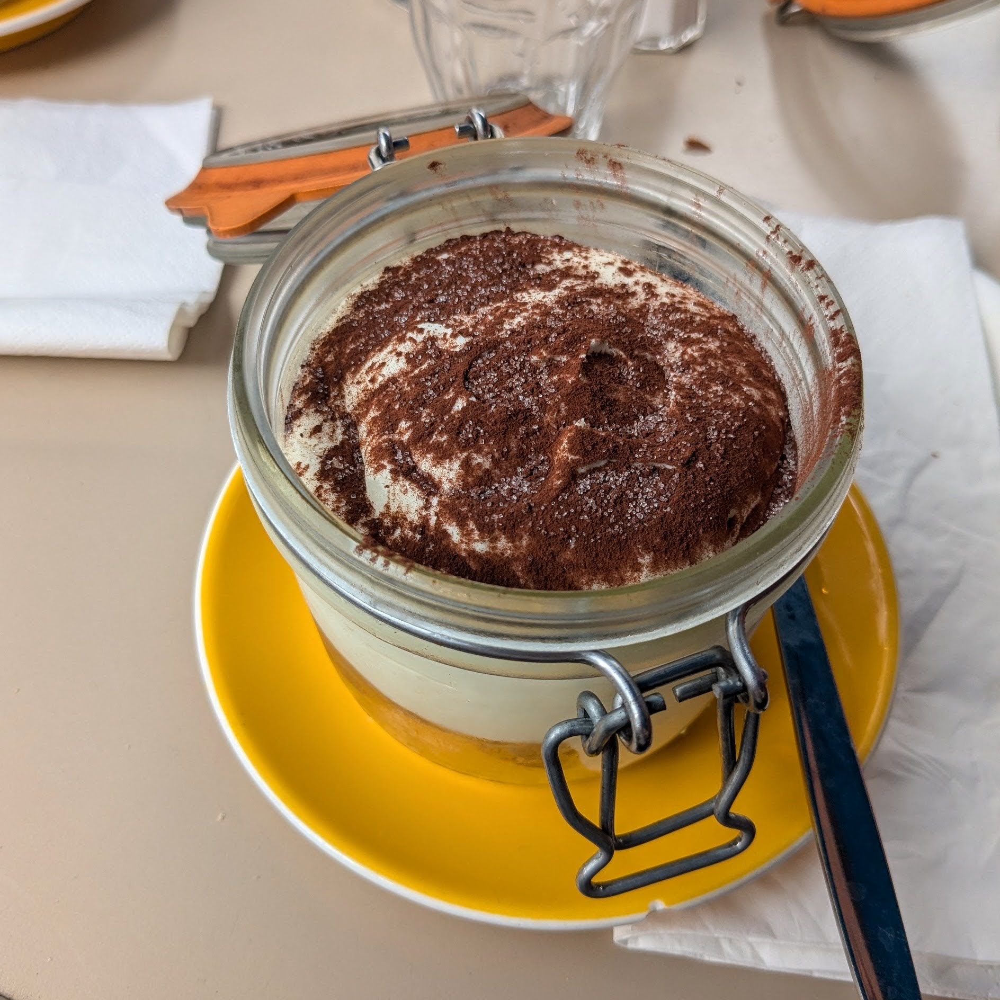

L'Alouette est une brasserie dans le 13e arrondissement de paris à la note de 4,1/5 sur Google.

Ils nous proposent un tiramisu, vendu sur la carte comme : *"Le légendaire tiramisu de l'Alouette"* (8,50€).  
Alors forcément, je m'attendais à quelque-chose de *LÉ-GEN-DAIRE*.

C'est joli et bien présenté.  
Mais quelque chose me choque rapidement : le SUCRE ! Il y'a du sucre en poudre par dessus !

Ok plongeont la cuillière dedans.

La crême est consistante, et comme le laissait présagé le dessus, trés sucré. 

Comme souvent dans les tiramisu de restaurants, ca ressemble plus à de la chantilly qu'a de la crème aux oeufs et au mascarpone.

Alors il n'est pas mauvais, mais je le trouve vraiment trop sucré.

Le biscuit est bien caféiné, il ne dégouline pas. Rien de particulier à ajouter dessus, il est trés correcte ce biscuit.
